# Big Image Fusion with BigDataViewer Playground

**NOTE:** If you want to give a try to this fusion method, you can register and create an xml dataset from the Demo LISH file in https://zenodo.org/records/8305531

**NOTE:** Instead of following this documentation which breaks down each step, if you have a ready to fuse xml BigStitcher dataset, you can directly use the `Fuse a BigStitcher dataset to OME-Tiff`:

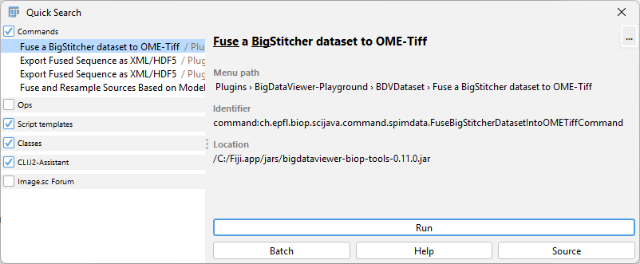

**WARNING:** There is a problem in the fuser implementation which can lead to overflow. Bright pixels may overflow in regions when the summed value is above 65,536.

**Vocabulary:**
- **Source:** A single channel image, which can have several slices and frames.
- **Cell:** A 3D block of pixels (e.g., 64x64x64) within a source.

## BigStitcher Fusion Noticed Issues

It may happen that multi-tile images much bigger than RAM are not fused fast enough with BigStitcher.

There are several reasons for this:

- Datasets are loaded with [Soft References](https://www.baeldung.com/java-soft-references) by default, meaning that as you stream the data from disk, as many cells as possible are kept in RAM. The RAM starts to be freed when it is almost full. There are options in the VM (`-XX:SoftRefLRUPolicyMSPerMB=2500`) that aim at speeding up memory release, but it's not aggressive enough in practice. This leads to performance issues for big datasets because when the RAM is full, it becomes computationally costly to free memory, slowing down the fusion process, and you may even get some out-of-memory errors, even though using Soft Refs is supposed to guarantee that this does not happen.

- The fusion process, at least in the default BigStitcher way, iterates over all tiles for each fused pixel. This becomes particularly bad when you have many non-overlapping tiles (many tiles in 2D = very bad).

- With Hdf5 format, the reading is not parallel, but this is a minor issue compared to the other two.

**Note:** There is [BigStitcher Spark](https://github.com/PreibischLab/BigStitcher-Spark/blob/main/README.md) which exists and should be faster, but I did not test it. It's not integrated into Fiji (command line tool), and it works with 16-bit images only.

## Simple BigStitcher Fusion Workflow with BigDataViewer-Playground to OME-TIFF

Search for the following command in Fiji's search bar:

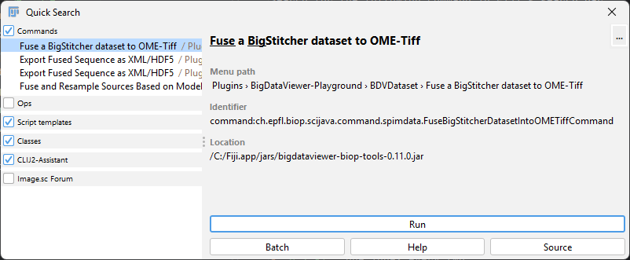

The interface is as follows:

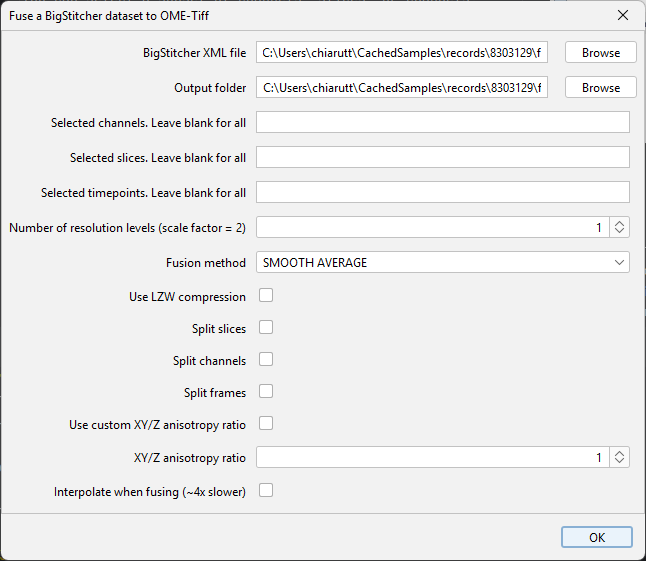

You can select a subset of channels, slices, or channels:
- `0:-1`: All indices (-1 is the index of the last element)
- `10:-1`: From index 10 to the last one
- `0:-11`: All indices except the last 10 ones
- `0:2:-1`: One index every two
- `-1:-1:0`: Reverse order
- `0,1,2,5`: Indices subset 0,1,2,5
- `0:2:-1, 1:2:-1, 50`: All even indices, then all odd indices, then index 50

## Step-by-Step BigDataViewer-Playground Fusion Workflow

Here is a workflow that addresses the two main issues: the dataset that needs to be fused is opened with a bounded cache, meaning it will clear memory efficiently before the RAM gets full, and the fusion process occurs by block, where a filtering of the tiles overlapping with the block is first computed before fusing each block.

This workflow was developed to support OME-TIFF (QuPath) export with 8-bit, 16-bit, and RGB pixels, as well as making sure that big 2D planes work as well. Export of 16-bit images to XML-HDF5 works as well.

Enabling the PTBIOP update site is compulsory for this workflow.

### Step 1: Open the Dataset 

Look for this command:

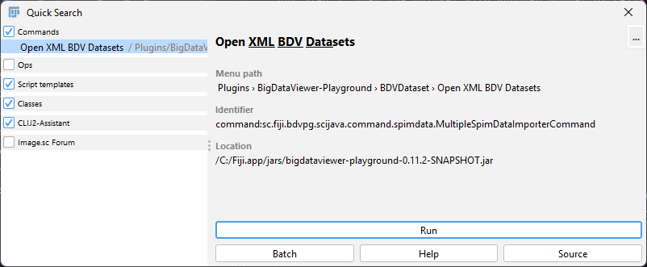

Select your XML dataset file and open it. Opening the dataset this way will take care of evicting the data when the RAM gets occupied at 50%.

After clicking OK, you end up with a window with nodes that can be expanded:

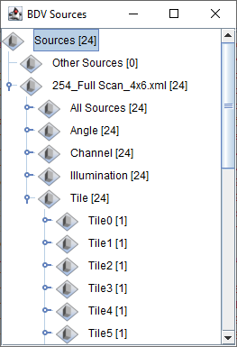

### Step 2: Define the Fusion Model

In this step, we define a dummy image (or source) which will serve as the template that is used for fusing the image. This means the dummy image defines a portion of the physical space (3D bounds) with a certain grid size (= voxel size).

Usually, with BigStitcher, you want this template to span all tiles, and by convention, the voxel size is 1 in XY, and a certain size in Z (maybe the Z spacing is bigger than the XY spacing).

To define the model, look for this command:

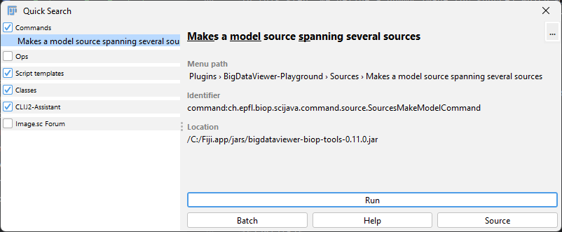

And here is an example of settings used:

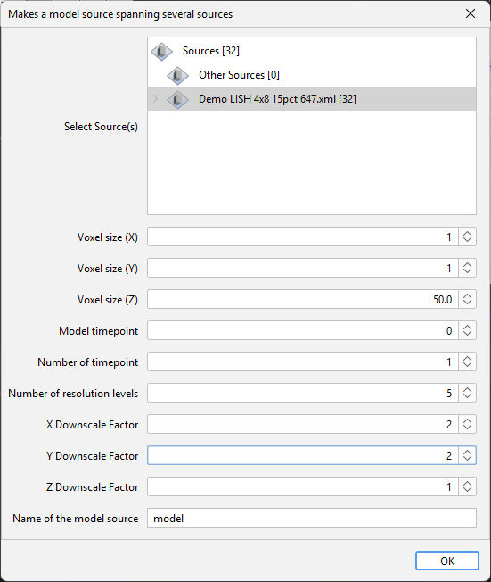

Notice that the model appears in the BDV-Playground tree view:

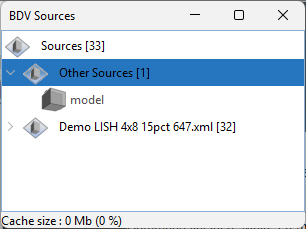

**NOTE:** The model is actually a black image. The advantage of defining a model as an image is that you could use an image as the fusion template. For instance, if you position a mouse atlas correctly in physical space, you could directly use the atlas image as a fusion template.

### Step 3: Make the Fused Source

Look for this command:

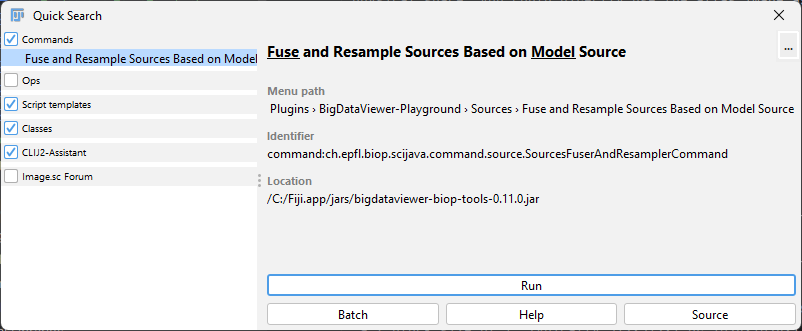

Select:
- The sources you need to fuse (only pick a single channel)
- The model
- Click `Cache` – this will enable the fusion by block with pre-filtering of tiles.
- Choose a block size. If you go for OME-TIFF export, it's best to select a Z block size of 1. Typically 512x512x1 or 1024x1024x1 is a standard reasonable size.
- NThreads: The number of threads used to compute blocks in parallel. Advised: Put the number of cores of your CPU.
- Give a name (specifying the channel if you have multiple channels)
- Blending mode: Usually smooth average if you perform fusion.

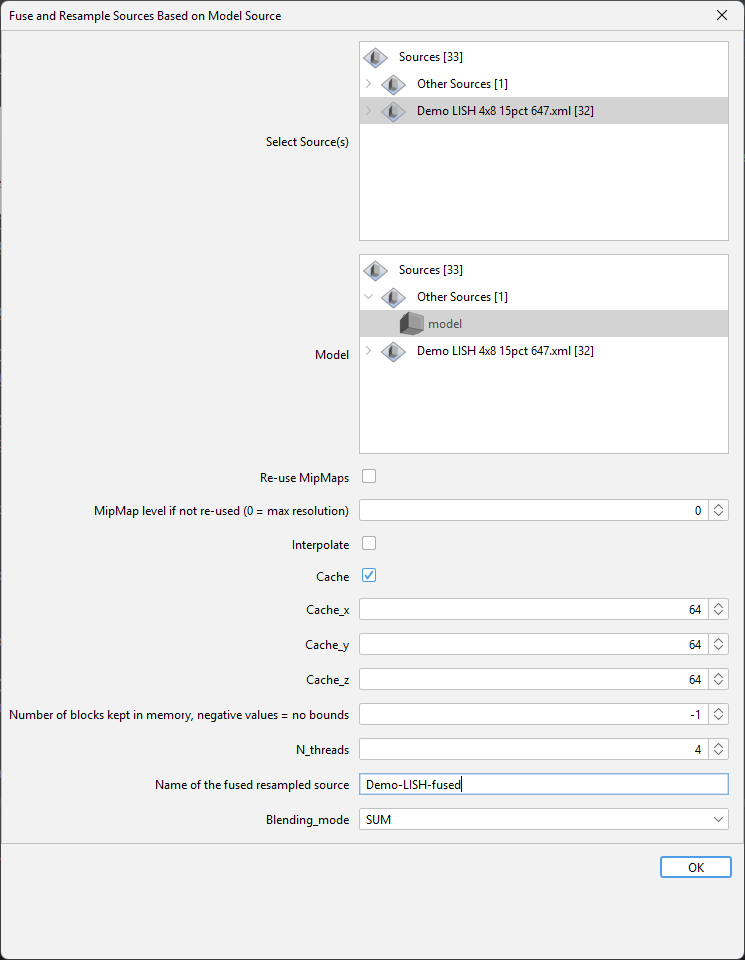

Repeat this procedure for each channel.

In the demo, I have only one channel:

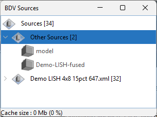

**NOTE:** You can now investigate the result of the fusion before running the export. Simply right-click on the fused image(s) and select `BDV - show sources`. This is possible thanks to block computation and on-demand rendering of BigDataViewer.

### Step 4: Export Fused Source to OME-TIFF

Look for the following command:

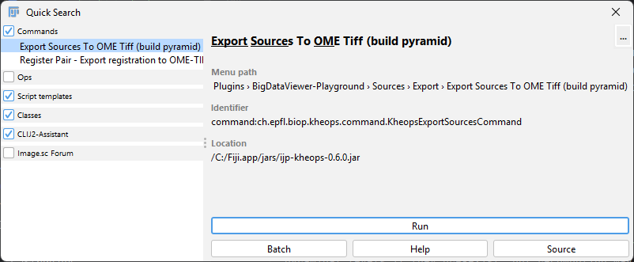

(You may choose the other one: `Export Sources To OME Tiff`, it will keep pyramidal levels if they pre-exist, but recomputing may be faster).

Fill in:
- The source you want to export (fused sources, several ones if you have multiple channels)
- You can leave blank the selected channels, slices, and timepoints, but you can also select a subset. For instance, putting `0:10:-1` will pick 1 slice every 10 slices. `-1` indicates the index of the last slice.
- I generally use a tile size that matches the block size specified for the fused source.
- Use all cores for the threads.
- Number of tiles computed in advance: Generally a few times the number of cores. It ensures that there are still some jobs enqueued for the fusion.

The compression is highly recommended (you may have plenty of black) and does not create too much overhead.

For instance:

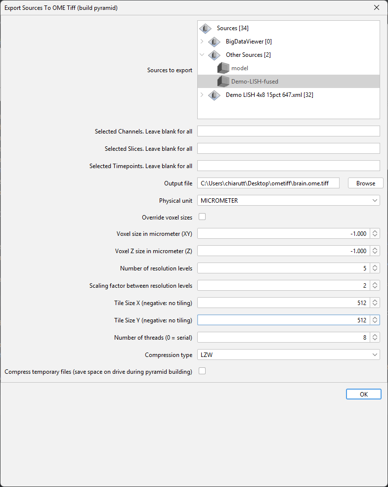

**THEN IT BEGINS!**

You can click on the little rectangle next to Fiji's search bar if you activated the task preview update site (see above).

You end up with this window:

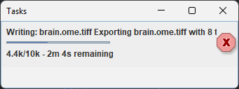

The first bar is not really a task; it indicates the number of blocks currently being queued to be written or actively being processed for fusion. The second bar shows the overall progression. It may take some time but will be linear after some time.

You can now check that the resources are used correctly. Use the `Memory monitor` of Fiji (look in the search bar). It should have a saw-tooth pattern and should not drift upwards:

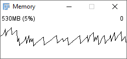

You can set a low RAM amount (like 4 GB). This should not cause any problem.

You can check whether your CPU is used efficiently. In Windows, you can do that with the Task Manager:

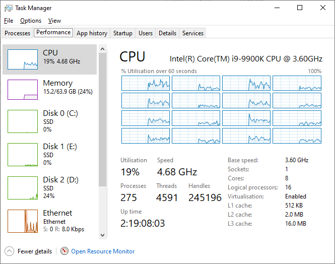

In this picture, we see only 30% is used, which is not optimal but not terrible either. It's linear over time, so the process will end. Tuning a bit the fetcher threads, the block size, and the number of cores used may affect the performance.

### Step 4: Export Fused Source to XML/HDF5

Look for this command:

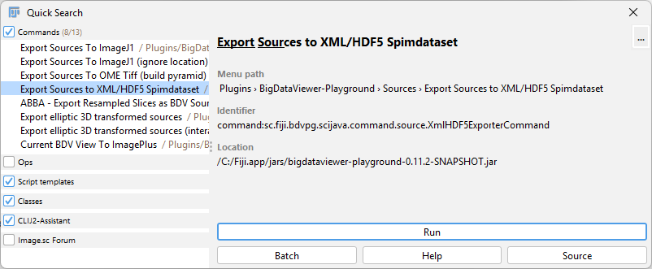

Here is an example of settings:

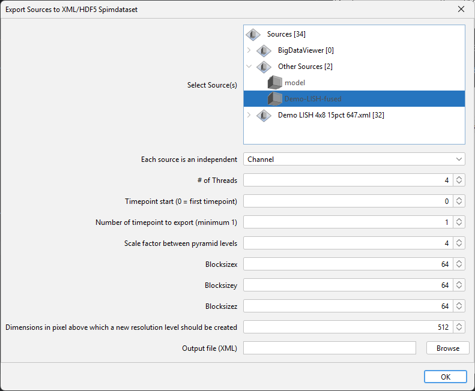

The task bar do not work, but you may have a look at the H5 file being written to see its progression.